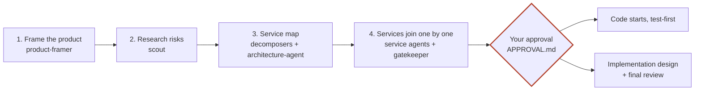

# Blueprint

**Design the architecture before writing code.** Blueprint is a set of Claude Code agents and skills that design a microservice system with you, step by step, in plain files. You approve short, diagram-first checkpoints, and **no code is written until you approve the architecture.**



**Technical:** an orchestrator skill (`/blueprint`) drives 11 specialized agents that share one rulebook. Decisions are recorded as ADRs, contracts between services are agreed in append-only logs, and every checkpoint opens with the architecture diagram. A gate (rules G1-G4, plus an optional hook) blocks code until the user's approval is recorded.

**Plainly:** you describe the product, the agents ask good questions, research what goes wrong in the real world, split the system into services, and argue each service's responsibilities out with each other. You see diagrams and decide. Building starts only after you say yes.

## Quick start

> **Using GitHub Copilot?** See [`copilot/`](copilot/README.md): the same process as a Copilot plugin, with cross-model review (`copilot plugin marketplace add nohemi20231/blueprint`, then `copilot plugin install blueprint@blueprint`).

```bash
git clone https://github.com/nohemi20231/blueprint.git ~/workspace/agents/blueprint
cd ~/workspace/agents/blueprint && ./install.sh
```

Restart Claude Code, then:

| Command | What it does |
|---|---|
| `/agents` | Should list the 11 Blueprint agents |
| `/blueprint` | Start a new design in the current project |
| `/blueprint resume` | Pick up a design from `docs/architecture/STATE.md` |

To update later: `git pull && ./install.sh`.

## How a design runs

| Step | Who | You see |
|---|---|---|
| 1. Frame the product | product-framer | One-paragraph brief + customer user flow. You confirm it. |
| 2. Requirements and research | scout | Production risks, market, competitors, existing systems to connect to |
| 3. Service map | 3 decomposers propose, architecture-agent decides | **Architecture diagram first**, then the user flow mapped to services, cost, compliance and real-world fit |
| 4. Services join one at a time | one service agent per service, gatekeeper | Each service created only after its decision record is saved and its contracts are agreed by both sides |
| **Gate** | gatekeeper + you | What you are approving, and what must not be built yet. **Your approval unlocks coding.** |
| 5. Implementation design | each service agent | Classes, ports and state machines per service, test plan |
| 6. Final review | gatekeeper | A 3-minute summary that routes READY, NEEDS YOUR DECISION or NEEDS MORE INFORMATION |

At any point you can change direction: work stops, the new direction is repeated back to you, and only the affected parts are redesigned.

## The agents

| Agent | Role | Model |
|---|---|---|
| `product-framer` | Confirms what the product is, in your words; owns the customer user flow | opus |
| `scout` | Production risks, market and competitors, existing systems, with sources | sonnet |
| `decomposer` | Proposes a service split with one strategy (run 3 in parallel) | opus |
| `architecture-agent` | Decides services, boundaries, shared-area owners and cross-service flows; owns the architecture and sequence diagrams | opus |
| `service-owner` | Owns one service end to end; one agent per service | opus |
| `compliance-reviewer` | Owns compliance findings (not legal advice) | opus |
| `cost-analyst` | Cost per transaction and break-even, with dated prices | sonnet |
| `operator-advocate` | Real-world fit for the business, its staff and customers | sonnet |
| `refactor-reviewer` | Neutral judge of refactors and direction changes | opus |
| `gatekeeper` | Creation checks, the approval gate, the final summary | opus |
| `scribe` | Keeps the state file, open items and decision index | haiku |

Skills: `blueprint` (the orchestrator, runs in your main session) and `design-rulebook` (the rules every agent loads).

## Key rules

| Rule | Technical | Plainly |
|---|---|---|
| G1-G4 | No code, build files or scaffolding before the approval in `APPROVAL.md`; agents write only to `docs/architecture/` | Nothing gets built until you say yes |
| T6 | The decider records the decision and updates every diagram it owns; an impact list sends the rest to their owners | Whoever decides, updates |
| U4 | Every checkpoint opens with the architecture diagram; elements marked confirmed / agent decision / pending | You see the picture first |
| B6 | Generalize only what would break later; no features "for later" | Build for now, stay ready for later |
| K5 | Every contract change is logged and accepted by both services | Agreements are written down and signed |
| A4 | Outcomes counted as AI alone / with human help / needed a fix | Honest accuracy numbers |
| T4 | "Not sure" means the safe, reversible default plus a reminder | You never get stuck on a question |

The full list is in [`skills/design-rulebook/SKILL.md`](skills/design-rulebook/SKILL.md).

## Optional: the no-code lock

A Claude Code hook that blocks creating or editing files outside `docs/` until `docs/architecture/APPROVAL.md` says **Status: APPROVED**. Turn it on per project:

```bash
cd <your-project> && mkdir -p .claude && cp ~/.claude/hooks/project-settings.example.json .claude/settings.json
```

If the project already has `.claude/settings.json`, merge the `hooks` section instead. Projects without `docs/architecture/` are not affected. The lock watches file edits, not shell commands; rule G1 covers those.

## What a design produces

```
docs/architecture/
  product-brief.md        STATE.md            APPROVAL.md
  requirements.md         open-items.md       decision-log.md
  scout-brief.md          risks.md
  diagrams/   architecture.md, user-flow.md, sequences/<flow>.md
  adr/        0001-....md  (one per decision)
  contracts/  <service-a>--<service-b>.md  (agreement logs)
  services/<name>/  charter.md, contracts.md, decisions.md, model.md, qa.md, implementation.md
  reviews/    compliance, cost, operator
```

## Repository layout

| Path | Contents |
|---|---|
| `agents/` | The 11 agents, installed to `~/.claude/agents/` |
| `skills/blueprint/` | The orchestrator and its templates |
| `skills/design-rulebook/` | The shared rules |
| `hooks/` | The no-code lock and an example project setting |
| `copilot/` | The GitHub Copilot version: plugin, 13 agents, skills, gate hook and its tests |
| `install.sh` | Copies everything into `~/.claude` |
| `CHANGELOG.md` | Versions, the reasons behind each change, known risks |
| `LICENSE`, `NOTICE` | Apache License 2.0 and the attribution to keep when redistributing |

## Requirements

- [Claude Code](https://code.claude.com/docs) with custom agents and skills
- Bash (macOS or Linux) for `install.sh` and the optional hook

## License

Copyright 2026 Nohemi Gonzalez Lopez. Licensed under the [Apache License, Version 2.0](LICENSE). You may use, change and share Blueprint, including commercially; keep the [`NOTICE`](NOTICE) file and mark the files you change.
