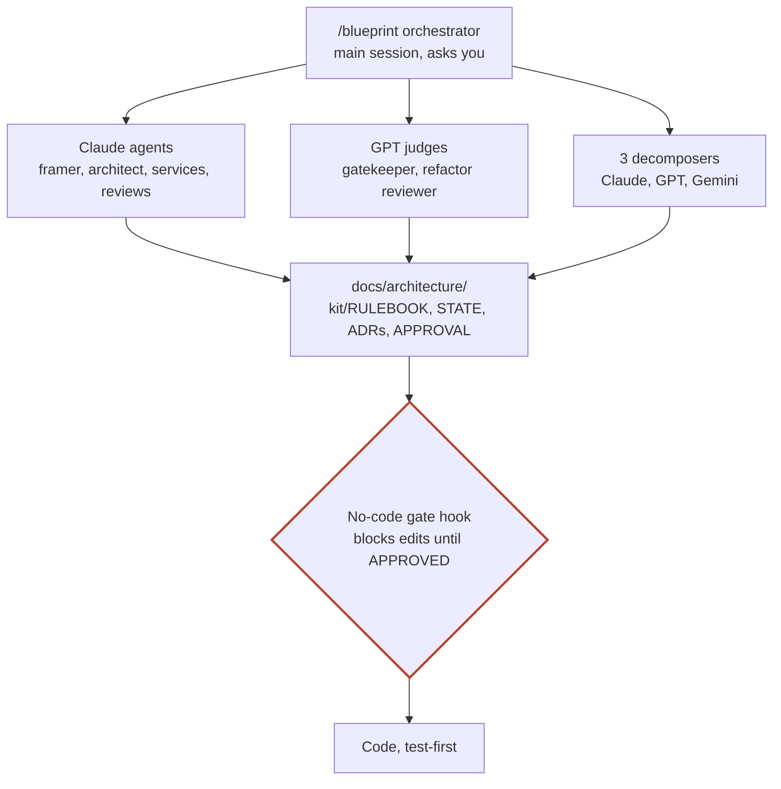

# Blueprint for GitHub Copilot

**Design the architecture before writing code, in the GitHub Copilot app.** The same Blueprint process as the Claude Code version: you approve short, diagram-first checkpoints, and **no code is written until you approve the architecture.** This version adds cross-model review: the judges run on a different model family than the designers.



**Technical:** a Copilot plugin with the `/blueprint` orchestrator skill, the `design-rulebook` skill, 13 custom agents with their own models and tool lists, and a `preToolUse` hook that blocks file edits outside `docs/` until `docs/architecture/APPROVAL.md` says **Status:** APPROVED.

**Plainly:** the same design team as Blueprint, packaged for Copilot, with a second opinion from a different AI built in.

## Install

In a terminal with the GitHub Copilot CLI:

```bash
copilot plugin marketplace add nohemi20231/blueprint
copilot plugin install blueprint@blueprint
```

The Copilot app documents that plugins can bundle skills, hooks and custom agents and are managed under **Plugins** in its settings; check there that Blueprint is listed and enabled.

Then, in a project, start a session and type `/blueprint`. To resume a design: `/blueprint resume`.

To update, run the install command again.

## The agents

| Agent | Model | Role |
|---|---|---|
| `product-framer` | Claude Opus 5.5 | Confirms what the product is, in your words; owns the customer user flow |
| `scout` | Claude Sonnet 5.5 | Production risks, market and competitors, existing systems, with sources |
| `decomposer-capability` | Claude Opus 5.5 | Service split by business capability |
| `decomposer-context` | GPT-5.5 | Service split by bounded context |
| `decomposer-data` | Gemini 3.8 Flash | Service split by data ownership and consistency |
| `architecture-agent` | Claude Opus 5.5 | Decides the service map, boundaries, shared-area owners and cross-service flows |
| `service-owner` | Claude Opus 5.5 | Owns one service end to end; called once per task, its dossier is its memory |
| `compliance-reviewer` | Claude Opus 5.5 | Compliance findings (not legal advice) |
| `cost-analyst` | Claude Sonnet 5.5 | Cost per transaction and break-even |
| `operator-advocate` | Claude Sonnet 5.5 | Real-world fit for the business, its staff and customers |
| `refactor-reviewer` | GPT-5.5 | Neutral judge of refactors and direction changes |
| `gatekeeper` | GPT-5.5 | Creation checks, the approval gate, the final summary |
| `scribe` | Claude Haiku 5.5 | Keeps the state file, open items and decision index |

To change a model, edit the `model:` line in `agents/<name>.agent.md`. If a model is not on your plan, the orchestrator tells you, so you can pick another.

## How it differs from the Claude Code version

| Claude Code | Copilot |
|---|---|
| 11 agents, one `decomposer` run 3 times | 13 agents: 3 decomposers, each on a different model family |
| Every agent on Claude | Judges and two decomposers on GPT and Gemini |
| Rulebook preloaded into each agent | The orchestrator copies the rulebook and templates into `docs/architecture/kit/`; every agent reads it first |
| Agents kept alive with SendMessage | Every call starts fresh; agents work from their files (dossiers, contract logs, ADRs) |
| Hook copied into each project | The plugin's hook covers every project with a design; optional project copy in `.github/hooks/` for teammates and the cloud agent |
| `install.sh` | `copilot plugin install blueprint@blueprint` |

The design files are nearly the same, so a design can move between versions: the Copilot version adds `docs/architecture/kit/` (the Claude Code version ignores it), and `STATE.md` names agents instead of agent IDs.

## The no-code gate

The hook runs before every file tool call and only acts in projects that have `docs/architecture/`. Until `APPROVAL.md` says **Status:** APPROVED it blocks creating or editing files outside `docs/`, `README.md`, `AGENTS.md`, `CLAUDE.md`, `RESUME.md` and `.github/copilot-instructions.md` (Phase 0 may add the optional project lock in `.github/hooks/` once; nothing may edit it afterwards). Writing `APPROVAL.md` itself always asks you to confirm, so no agent can approve its own design. It watches file tools, not shell commands; rule G1 covers those.

The script is written for the documented hook input of Copilot (app, CLI and cloud agent), VS Code and Claude Code, and is tested with sample payloads of each shape. Test it with:

```bash
bash copilot/tests/gate-test.sh
```

## Requirements and known limits

- GitHub Copilot app or CLI with plugin support; your organization may restrict which plugins you can install.
- Bash and `python3` (macOS or Linux; not Windows) for the gate. Without `python3`, or if the hook cannot find its script, the gate allows the call and prints a warning.
- The Copilot app is a technical preview, and this plugin was validated with the Copilot CLI's installer, not with a live app session. Per-agent models and plugin hooks are the parts to check on your first run: if an agent ignores its model, the cross-model check is weaker; if the gate does not block a test edit, accept the orchestrator's offer to add the project copy in `.github/hooks/`.
- Copilot may not have a built-in web search; the scout, cost and compliance agents then fetch known primary sources and list what they could not search. The Copilot cloud agent has no web tool at all.
- Copilot bills by usage. Reviews run only at checkpoints and rounds are capped, but a full design with top models costs more than a single chat.

## License

Copyright 2026 Nohemi Gonzalez Lopez. Licensed under the [Apache License, Version 2.0](../LICENSE); keep the [`NOTICE`](../NOTICE) file when redistributing.
