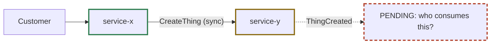

# Diagram conventions (rule U4)

All diagrams are Mermaid, saved as markdown files so they render on GitHub, in IntelliJ and in artifacts.

## Where diagrams live, and who owns them (T6)
| Diagram | File | Owner (decides and updates) | First needed |
|---|---|---|---|
| Architecture (services, clients, external systems, sync and async links) | `docs/architecture/diagrams/architecture.md` | architecture-agent | Checkpoint 2 - shown first at every checkpoint after |
| Cross-service sequence diagram per user-flow decision | `docs/architecture/diagrams/sequences/<flow>.md` | architecture-agent; each participating service agent confirms its part | Before the user decides that flow |
| Customer user flow | `docs/architecture/diagrams/user-flow.md` | product-framer | Checkpoint 1 |
| Software design model (classes, ports, state machines) of one service | `docs/architecture/services/<service>/model.md` | that service's agent | Draft at creation; final in implementation |

When a decision changes a diagram owned by someone else, the decider puts that owner in its **impact list**; the owner updates its own diagram. The scribe never edits diagrams.

Each file starts with a two-line explanation: **Technical:** one or two sentences; **Plainly:** the same in everyday words.

## Status marking (paste into every flowchart)
```
classDef ok stroke:#2e7d4f,stroke-width:2.5px
classDef agent stroke:#8a6a12,stroke-width:2.5px
classDef pend stroke:#b4442f,stroke-width:2.5px,stroke-dasharray:6 4
```
- `:::ok` - confirmed by the user
- `:::agent` - decided by agents, not yet confirmed by the user
- `:::pend` - pending a decision (write "PENDING: <question>" in the label)

Sequence and state diagrams cannot take classes: write `(agent decision)` or `PENDING` in the message or note text instead, and use `alt` blocks for undecided branches.

## Rules
- Every step of the customer journey in the product brief appears in the user flow.
- Every sync call and event in the architecture exists in a `contracts.md`, and every contract appears in the architecture.
- A sequence diagram uses the exact operation and event names from the contracts.
- When a decision changes, the decider updates its own diagrams in the same step and every owner on the impact list updates theirs; each bumps the "Last updated" line.
- The gatekeeper treats a diagram that disagrees with a contract or a status as a failed check.

## Example (flowchart)

